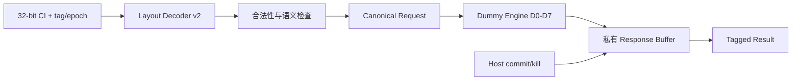

# AutoISA Compute-only CI Harness 当前设计与符合性报告

> 报告日期：2026-08-10  
> 目标平台：CVA6 `cv32a65x`，RV32  
> 当前工具证据：Vivado/XSim 2025.2  
> 当前阶段结论：**REVISE（Engine skid 与 D0–D11 已接入，完整 Harness 仍在开发）**

---

## 1. 报告目的

本报告回答以下问题：

1. 当前已经设计了哪些 RTL、仿真和 CI 组件；
2. 这些代码采用了什么设计方法；
3. 当前获得了哪些可以复查的数据；
4. 当前实现是否满足 `AutoISA-Compute-only-CI-Harness.md` 的要求；
5. 下一步最合理的工作是什么。

判断只依据当前工作区中的 RTL、testbench、计划文档和 Vivado/XSim 日志。
没有完成的综合、面积、时序、CVA6 architectural simulation 和性能数据不会被推测或补写。

---

## 2. 总体结论

当前工程已经形成六个经过自检的设计增量：

1. **单事务功能 Harness v0**：完成指令识别、语义执行、commit 可见性、kill
   抑制和结果反压；
2. **参数化 Request Queue**：完成请求缓存、空队列 bypass、满队列反压、
   同周期进出、flush 和统计计数；
3. **参数化 Inflight Table**：完成多事务身份管理、重复 tag 拒绝、最老优先
   dispatch、乱序完成捕获、commit-gated retire 和三阶段 kill；
4. **Concurrent Shell 初版**：通过原子双分配连接 Request Queue、Inflight Table
   和单 Dummy Engine，完成入口判重、queued tombstone 排空、flush 和 tagged retire；
5. **Result Queue 与 completion credits**：完整保存 1W/2W response，dispatch 前预留
   credit，并在 result enqueue、dispatched kill 或 flush 时正确释放；
6. **Engine skid 与 D8–D11 protocol dummy**：加入 kill-aware 1-entry skid，D8
   variable latency、D9 long、D10 backpressure 和 D11 fault 均有定向测试。

这说明当前已经从“能不能识别并执行一条 CI”推进到“能不能保存和跟踪多条 CI”。
当前已形成带 Result Queue、显式 credits 和单 engine skid 的最小 concurrent shell，
但仍缺少多 engine oldest-ready scheduler 和随机并发闭环；Host 侧 operand gather、destination map、
writeback/forwarding 和真实 CVA6 流水线也未接入。

因此当前可以给出的结论是：

```text
单事务功能证明：PASS
Request Queue 单元：PASS
Inflight Table 单元：PASS
Concurrent Shell 初版：PASS
Result Queue 单元：PASS
Engine Protocol D8–D11：PASS
完整 Concurrent Coprocessor Shell：部分完成
CVA6 Architectural Harness：未完成
Harness GO：不能宣布
当前工程决策：REVISE / 继续开发
```

---

## 3. 需求边界

### 3.1 Compute-only 约束

当前默认路径遵守纯计算模型：

```text
results = F(operands, immediate)
```

默认 CI 不发起 load/store，不修改 CSR，不改变控制流，也不拥有隐藏架构状态。
普通内存访问继续由 CVA6 原 LSU/MMU/cache 完成。

`autoisa_h1_pair_load.sv` 是此前的 Host memory experiment，只作为独立参考保留，
没有进入当前 compute-only canonical request 数据通路。这一点符合需求文档对 H1 的隔离要求。

### 3.2 当前参数包络

| 项目 | 当前值 | 需求默认值 | 当前判断 |
|---|---:|---:|---|
| XLEN | 32 | 32 | 符合 |
| MAX_SRC | 6 | 6 | 符合 |
| MAX_DST | 2 | 2 | 符合 |
| TAG_WIDTH | 4 | 最小 4 | 符合 |
| EPOCH_WIDTH | 2 | 2 | 符合 |
| CI_ID_WIDTH | 8 | 8 | 符合 |
| LAYOUT_ID_WIDTH | 4 | 4 | 符合 |
| Request Queue 默认深度 | 4 | 4 | 符合 |
| Request Queue 参数 | 1/2/4/8 | 1/2/4/8 | 已展开验证 |
| Inflight 默认深度 | 4 | 4 | 符合 |
| Inflight 参数声明 | 2/4/8 | 2/4/8 | 深度 4 已运行功能测试 |
| Result Queue | 默认 4，可配 1/2/4/8 | 默认 4 | 单元初版符合 |
| 物理寄存器读口 | 尚未接入 | 2 | 尚不能验证 |
| 默认新增 WB 口 | 未新增 | 不增加 | 当前未违反，但尚未集成 |

---

## 4. 当前设计构成

### 4.1 Canonical ABI：`autoisa_ci_types_pkg.sv`

该 package 是各模块共同使用的接口定义，包含：

- `autoisa_ci_host_desc_t`：decode 后、gather 前的 Host 描述符；
- `autoisa_ci_req_t`：送入计算侧的 canonical request；
- `autoisa_ci_rsp_t`：带 tag/epoch 的 canonical response；
- status 和 backend 枚举；
- 6 输入、2 输出、4-bit tag、2-bit epoch 等固定能力参数。

设计重点是把 architectural register address 留在 Host descriptor 中，而
canonical request 只携带已经收集好的 operand 数据。这样 engine 不依赖 CVA6
寄存器编号，后续不同 backend 可以复用同一计算语义。

### 4.2 Layout Decoder v2：`autoisa_ci_layout_decoder_v2.sv`

Decoder v2 使用每个 layout 独立的 32-bit `match/mask` 识别方式，而不是强制所有
layout 共用一个固定的 layout 字段。`layout_id` 是 decoder 的内部输出。

当前手写 catalog 包含八种布局：

| Layout | 能力 | 当前语义 |
|---|---|---|
| L0 | 2R1W GPR32 | D0_ADD2 |
| L1 | 3R1W GPR32 | D1_MAC3 |
| L2 | 4R1W GPR8 | D2_MIX4 |
| L3 | 2R2W derived pair | D3_SUMDIFF |
| L4 | 4R2W GPR8 | D4_BFLY4X2 |
| L5 | 6R1W GPR8 | D5_REDUCE6 |
| L6 | 6R2W GPR8 | D6_DUAL6 |
| L7 | 2R1W + signed immediate | D7_IMM_MIX |

Decoder 会检查 x0 destination、非法 pair destination 和不支持的 layout/semantic
组合。当前 catalog 能证明接口表达能力，但仍是手写 bring-up 版本，尚未实现需求中的
schema、overlap report、encoder helper 和 deterministic generator。

### 4.3 Dummy Compute Engine：`autoisa_ci_dummy_engine.sv`

当前 engine 是单 active transaction 的 reference engine，使用 ready/valid 接收
canonical request，并按 `ci_id` 执行 D0–D7：

| Dummy | 结果公式（32-bit bit-vector） | 建模 latency |
|---|---|---:|
| D0 | `a + b` | 1 |
| D1 | `a * b + c` | 2 |
| D2 | `((a * b) + c) ^ d` | 3 |
| D3 | `y0=a+b; y1=a-b` | 2 |
| D4 | `y0=a*c-b*d; y1=a*d+b*c` | 4 |
| D5 | `a+b+c+d+e+f` | 3 |
| D6 | `y0=a*b+c*d+e*f; y1=a*b-c*d+e*f` | 5 |
| D7 | `(a << shamt) ^ (b + immediate)` | 1 |

D0–D7 主要用于验证接口、输入数量、双输出和 latency 行为，不等于已经证明应用收益。
D8 variable-latency、D9 long、D10 backpressure 和 D11 fault protocol dummy 已实现。

### 4.4 单事务 Harness：`autoisa_ci_harness_v0.sv`

Harness v0 把 Decoder v2 和 Dummy Engine 组成一个最小闭环：



关键控制关系为：

```text
result_visible = live
              && engine_done
              && commit_seen
              && !killed
              && !matching_kill_this_cycle
```

因此 engine 可以在 commit 前投机计算，但结果只能在 commit 后对外可见；kill
优先级高于完成和写回。该版本同一时间只保存一条 live transaction。

### 4.5 Request Queue：`autoisa_ci_request_queue.sv`

Request Queue 保存完整 `autoisa_ci_req_t`，当前支持：

- 深度 1/2/4/8；
- ready/valid 和 full backpressure；
- empty fall-through bypass；
- 同周期 enqueue/dequeue；
- 满队列同周期 pop/push replacement；
- pointer wrap；
- flush；
- occupancy、高水位、enqueue/dequeue/full-stall lifetime counters；
- 输出反压时 payload 稳定 assertion。

它目前是独立模块，尚未与 Inflight Table 和 engine 组成统一 shell。

### 4.6 Inflight Table：`autoisa_ci_inflight_table.sv`

Inflight Table 是最近新增的多事务跟踪模块，支持：

- 深度 2/4/8，默认 4；
- `(tag, epoch)` 唯一性检查；
- duplicate identity 拒绝；
- 按分配年龄进行 oldest-first dispatch；
- tagged out-of-order completion capture；
- result-before-commit 与 commit-before-result；
- commit 后才允许 retire；
- retire backpressure 时锁定输出 entry，保持 payload 稳定；
- queued、running、completed 三个阶段的 kill；
- kill 优先于 completion、commit、dispatch 和 retire；
- killed entry 的晚到 completion 自动 drain/drop，并计入 orphan counter；
- allocated、retired、killed、orphan、occupancy 和 high-watermark 统计。

该模块把 terminal accounting 表达为：

```text
accepted request -> retired 或 killed
```

当前 testbench 结束时验证：

```text
allocated = 7
retired   = 4
killed    = 3
orphan completion = 1
occupancy = 0
retired + killed = allocated
```

它已通过 Concurrent Shell 连接 result credit reservation 和独立 Result Queue。

### 4.7 Concurrent Shell：`autoisa_ci_concurrent_shell.sv`

该模块使用原子 acceptance contract：Queue 与 Inflight 必须在同一周期都能接收，
请求才算 accepted。入口同时查询 queued 和 inflight identity，避免重复 tag 堵住队头。
Killed queued entry 作为 tombstone 排空而不执行；当前连接一个 D0–D7/D9 Dummy Engine。

### 4.8 Result Queue 与 completion credits

`autoisa_ci_result_queue.sv` 保存完整 tagged response，支持深度 1/2/4/8、1W/2W
原子 entry、bypass、full replacement、flush-drop 和反压稳定性。Concurrent Shell 在每次
dispatch 前预留一个 completion credit；result 从 Inflight 转入 Result Queue、已 dispatch
事务被 kill 或全局 flush 时归还 credit。`result_occupancy + reserved_credits` 不得超过深度。

### 4.9 Engine skid 与 D8–D11

`autoisa_ci_engine_skid.sv` 是 scheduler 与 engine 之间的 1-entry elastic buffer。
它区分 dispatch-to-skid 与 engine-start：skid 中 kill 直接删除请求且不执行，running kill
则由 Inflight 回收状态并 drain 晚到结果。D8 latency 由 `operand0[2:0]+1` 决定（1–8），
D9 latency=16，D10 验证 result backpressure，D11 返回 `ENGINE_FAULT`。

### 4.10 旧版 Adapter 与 H1 参考模块

工程中还保留：

- `autoisa_ci_layout_decoder.sv`：旧版 generated-style decoder；
- `autoisa_ci_cva6_decode_adapter.sv`：旧版 CVA6 decode adapter；
- `autoisa_h1_pair_load.sv`：H1 Host memory experiment。

旧版 decoder/adapter 已做最小 Vivado `default_nettype none` 兼容修复，但它们不等于
当前 v2 compute-only 数据通路已经接入 CVA6。旧版与 v2 同时存在也容易引起集成选择
混淆，正式集成前应明确默认 source profile。

### 4.11 Testbench 与最小 CI 脚本

当前自检 testbench 包括：

- `tb_autoisa_ci_harness_v0.sv`；
- `tb_autoisa_ci_request_queue.sv`；
- `tb_autoisa_ci_inflight_table.sv`。
- `tb_autoisa_ci_result_queue.sv`；
- `tb_autoisa_ci_engine_protocols.sv`；
- `tb_autoisa_ci_concurrent_shell.sv`。

`ci/autoisa/run_ci.py` 当前默认运行全部六个 testbench，并检查 XSim exit code、
`PASS:` 标记和 `$fatal`。

---

## 5. 采用的设计方法

### 5.1 ABI-first

先冻结 canonical descriptor/request/response，再写 decoder、engine、queue 和 table。
这样不同模块不会各自定义一套 tag、operand 或 result 格式。

### 5.2 Encoding 与语义分离

Decoder 负责“指令代表什么布局、需要哪些输入输出”，engine 负责“这些 operand
如何计算”。同一个语义未来可以通过 wrapper 连接 Host-local、CV-X-IF 或 Direct-CI
backend，而不必修改公式。

### 5.3 Host 与 Coprocessor 职责分离

Host 计划负责寄存器地址、destination reservation、gather、scoreboard 和 writeback；
Coprocessor 只接收 operand 数据并返回 tagged result。当前 RTL 已在 ABI 上遵守该边界，
但 Host 实际模块还未完成。

### 5.4 Ready/valid 与稳定性约束

所有主要边界使用 ready/valid。Queue、Harness 和 Inflight Table 都对 stalled payload
稳定性进行验证，避免下游反压时数据变化或丢失。

### 5.5 Tag + epoch 事务身份

Tag 区分同时存在的事务，epoch 防止 flush 后的旧结果误命中新事务。Inflight Table
按 `(tag, epoch)` 判重、匹配 commit/kill 和 completion。

### 5.6 投机计算、提交可见

Pure compute engine 可以提前执行，但 architectural visibility 必须等待 Host commit。
kill 可以在结果返回前取消事务，满足精确异常和流水线 flush 的基本方向。

### 5.7 小步闭环验证

开发顺序采用：

```text
单事务功能闭环
  -> Request Queue 单元
  -> Inflight Table 单元
  -> 安全入口仲裁
  -> Concurrent Shell
  -> Host/CVA6 Integration
```

这种方法可以把 decoder/计算错误、FIFO 错误、事务匹配错误和 CPU 集成错误分开定位。

---

## 6. 数据通路现状

### 6.1 已连通的 v0 路径

```text
instruction/tag/epoch/already-gathered operands
  -> decoder v2
  -> legality/semantic check
  -> canonical request
  -> single-active dummy engine
  -> private response buffer
  -> commit/kill gate
  -> result ready/valid
```

### 6.2 已连通的多事务初版

```text
Canonical Request
  -> atomic Queue + Inflight allocation
  -> oldest queued dispatch
  -> single Dummy Engine
  -> tagged completion capture
  -> commit/kill gate
  -> Result Queue + completion credits
  -> tagged result
```

入口通过同时查询 queue 和 inflight 的 `(tag, epoch)`，并要求两个存储结构原子接收，
解决了重复身份在 FIFO 队头永久阻塞的问题。当前为了保证 allocation 可见性，新请求至少
存入 Queue 一个周期，尚未实现 shell 级零周期 bypass 优化。

### 6.3 尚不存在的完整路径

```text
CVA6 issue
  -> tagged destination map
  -> two-port multi-beat operand gather
  -> request queue/inflight arbitration
  -> engine scheduler/skid
  -> result queue/credits
  -> commit/kill
  -> destination lookup
  -> forwarding/writeback
```

---

## 7. 已获得的验证数据

### 7.1 Vivado/XSim 结果

| Testbench | 最终结果 | 仿真结束时间 | 主要覆盖 |
|---|---|---:|---|
| `tb_autoisa_ci_harness_v0` | PASS | 525 ns | L0–L7、D0–D7、非法 pair、unsupported、commit gate、kill、result stall |
| `tb_autoisa_ci_request_queue` | PASS | 270 ns | depth elaboration、full、bypass、replacement、flush、counters |
| `tb_autoisa_ci_inflight_table` | PASS | 660 ns | 4 inflight、duplicate、OOO completion、stalled retire、三阶段 kill、terminal accounting |
| `tb_autoisa_ci_result_queue` | PASS | 290 ns | depth 展开、2W 原子 entry、full/bypass/replacement、flush-drop |
| `tb_autoisa_ci_engine_protocols` | PASS | 260 ns | D8 latency=1/8、D10 三周期 stall、D11 engine fault |
| `tb_autoisa_ci_concurrent_shell` | PASS | 685 ns | skid、4 inflight、result credit stall、kill、flush、late completion |

测试使用 Vivado/XSim 2025.2。全部 AutoISA 生产 RTL 已通过 `xvlog` 语法分析，上述
六个 testbench 均通过 `xelab` 静态展开和最终 XSim 自检。

这些 ns 数值是 testbench 结束时刻，只表示测试序列长度，**不是处理器性能、CI latency
或吞吐收益数据**。

### 7.2 Request Queue 观测数据

深度 4 测试中：

- occupancy 达到 4；
- high-watermark 达到 4；
- full 状态正确反压；
- full stall count 观测到 1；
- full pop/push replacement 后 occupancy 仍为 4；
- empty bypass 后 occupancy 保持 0；
- flush 后 occupancy 和 high-watermark 清零；
- lifetime counters 最终为 enqueue 7、dequeue 6、full stall 1。

深度 1/2/8 当前作为 elaboration sentinel 展开，尚未分别运行与深度 4 同等强度的完整
功能序列，因此不能把它们表述成“四种深度都已完整 unit test”。

### 7.3 Inflight Table 观测数据

- 同时 live transaction 数达到 4；
- high-watermark 达到 4；
- duplicate tag/epoch 被拒绝；
- dispatch 顺序按分配年龄选择；
- completion 可以按 3、1、4、2 的顺序进入；
- retire stall 时输出被锁定，不被后来变为 ready 的更老事务抢占；
- queued、running、completed 三种 kill 均被覆盖；
- running-kill 后的迟到 response 被消费并计为 1 个 orphan；
- 最终 `allocated=7, retired=4, killed=3, occupancy=0`；
- `retired + killed = allocated` 成立。

### 7.4 Concurrent Shell 观测数据

Concurrent Shell 集成测试得到：

```text
accepted=8, dispatched=8, engine_started=6, completed=6
retired=4, killed=4, orphan=2
skid_killed_drop=1, skid_flush_drop=1
request_high_watermark=2
inflight_high_watermark=4
result_high_watermark=2
credit_high_watermark=2
credit_stall_cycles=24
```

其中包含一次 executing + queued live flush；flush 后结构 occupancy 和 high-watermark
清零，执行引擎迟到结果被 drain/drop。

### 7.5 当前没有的数据

以下数据尚不存在，不能声称已经满足：

- CVA6 执行 custom CI ELF 的结果；
- 标准指令与 CI 混合执行 cycles/instructions；
- 100k-cycle random concurrency；
- Host gather beats 和 scoreboard stall；
- semantic CI 的 A/B 收益；
- stock/Harness/Harness+CI 的面积、Fmax 和功耗；
- 真实工艺综合结果和 release manifest。

---

## 8. 需求符合性矩阵

| 需求项 | 当前状态 | 证据与说明 |
|---|---|---|
| 默认 compute-only，无 memory side effect | 符合 | canonical request 无 memory protocol；H1 独立保留 |
| Canonical Host/request/response ABI | 基本符合 | package 已定义 6R/2W/tag/epoch 类型 |
| 每 layout 独立 match/mask | 部分符合 | Decoder v2 已采用；尚未由 schema/generator 产生 |
| L0–L7 representative layouts | 符合初版 | 八种 layout 已识别并在 v0 TB 中执行 |
| x0/pair/unsupported 明确拒绝 | 符合初版 | Harness TB 已覆盖非法 pair 和 unsupported semantic |
| D0–D7 bit-vector dummy | 符合初版 | XSim PASS |
| D8–D11 protocol dummy | 符合定向初版 | D8=1–8、D9=16、D10 stall、D11 fault 均已验证 |
| ready/valid 与 stalled payload 稳定 | 基本符合 | Harness、Queue、Inflight 单元已测 |
| Request Queue 深度 1/2/4/8 | 部分符合 | 全部可展开；完整动态测试主要为 depth=4 |
| Queue occupancy/counters/bypass/flush | 符合单元级 | Queue TB PASS |
| 至少 4 个 inflight | 符合单元级 | Inflight TB high-watermark=4 |
| duplicate tag/epoch 检查 | 符合单元级 | 重复身份被拒绝 |
| tagged OOO completion | 符合单元级 | 独立 Inflight Table 捕获乱序 completion |
| queued/running/completed kill | 符合单元级 | 三个阶段均有定向测试 |
| 每 accepted request 唯一 terminal outcome | 符合当前测试 | 7 accepted = 4 retired + 3 killed |
| Result Queue 深度 1/2/4/8 | 部分符合 | 全部可展开；depth=4 单元、depth=2 shell 动态测试 |
| Completion credit manager | 符合初版 | dispatch reserve、enqueue/kill/flush release，credit stall=13 |
| Queue + Inflight + Engine concurrent shell | 部分符合 | Result Queue/credits/skid 已连接；多 engine/random 未完成 |
| oldest-ready multi-engine scheduler/skid | 部分符合 | 单 engine skid 已完成；多 engine ready selection 未实现 |
| Host tagged destination map | 不符合 | 未实现 |
| 1–6R 两读口 multi-beat gather | 不符合 | 当前 operand 由 TB 预先提供 |
| forwarding/writeback/pair atomicity | 不符合 | 尚未接入 CVA6 |
| CVA6 custom CI architectural ELF | 不符合 | 当前只有 standalone RTL TB |
| Q00–Q15 | 不符合 | 只覆盖其中一部分定向场景 |
| MIX00–MIX11 | 不符合 | 未实现 |
| Schema/CDFG/SV/reference 自动生成 | 不符合 | 尚未实现 |
| Semantic CI A/B 收益 | 不符合 | 尚无性能实验 |
| PPA 与 release manifest | 不符合 | 尚无可靠综合数据 |

### 8.1 Gate 判断

| Gate | 当前判断 | 原因 |
|---|---|---|
| G0 Schema/Generator | 未通过 | v2 catalog 仍手写，无 generator 全套产物 |
| G1 RTL Unit | 部分通过 | ABI、decoder、request/result queue、inflight、commit/kill 有覆盖；destination map、gather 缺失 |
| G2 Concurrent Shell | 部分通过 | Queue/Inflight/Result/credits、occupancy 和 kill/flush 已测；Q00–Q15 与 100k random 未完成 |
| G3 CVA6 Integration | 未通过 | 未执行 architectural custom CI |
| G4 Semantic Generation | 未通过 | 未实现 typed CDFG 生成流 |
| G5 Benefit Evaluation | 未通过 | 无 P0–P8 A/B 数据 |
| G6 PPA/Release | 未通过 | 无可信面积/Fmax/功耗和 manifest |

---

## 9. 当前风险和已知限制

1. **Shell bypass 尚未优化**：为保证 Queue/Inflight 原子分配可见，新 accepted request
   至少进入 Queue 一个周期；独立 Queue 的 fall-through 能力尚未传递到 shell 顶层。
2. **Credit manager 仍是单 engine 初版**：已防止 Result Queue 溢出，但尚未覆盖多个
   non-backpressurable pipeline、每 engine skid 和多 completion 同周期竞争。
3. **当前 engine 单 active**：D0–D7 的 latency 已建模，但没有证明 II=1 pipeline 或
   多 engine 并行。
4. **Host metadata 尚未闭环**：canonical request 不带 destination 是正确方向，但
   destination map 尚未实现，暂时无法真正 writeback。
5. **旧 decoder 与 v2 共存**：Bender 中同时存在旧版和 v2，正式集成时需要明确默认
   profile，避免连接错误模块。
6. **并发覆盖仍有限**：默认 CI 已包含四个 testbench，但尚无 fixed-seed 100k-cycle
   random test 和完整 Q00–Q15。
7. **缺少机器可读结果**：当前证据主要是 XSim transcript，没有 JSON counters、seed、
   hash 和 release manifest。
8. **没有 PPA 结论**：仿真 PASS 不能推导 area、Fmax 或性能收益。

---

## 10. 建议的下一阶段

下一阶段应继续 WP4/WP5，而不是直接修改 CVA6 主流水线：

1. 扩展为多 engine oldest-ready selection；
2. 建立至少 Q00–Q14 的定向回归，再进行固定 seed 的 100k-cycle Q15；
3. 输出 machine-readable JSON：accepted、dispatch、engine-start、complete、retire、kill、orphan、
   occupancy、credit 和 seed；
4. Concurrent Shell 关闭后，再进入 destination map、gather 和 CVA6 integration。

下一阶段的最低验收建议为：

```text
request occupancy > 1
inflight occupancy >= 4
tagged OOO completion observed
duplicate tag cannot enter or block the shell
queued/running/completed kill all pass
result backpressure causes no payload change or overflow
accepted = live + retired + killed + exception
reserved credits have no leak
fixed-seed random test reaches 100k cycles without deadlock
```

---

## 11. 最终评价

当前代码方向与需求的核心架构原则一致：compute-only、canonical ABI、per-layout
match/mask、ready/valid、tag+epoch、commit-gated visibility 和 kill priority 均已在小型
RTL 中得到实现与定向验证。

当前最有价值的成果不是性能数据，而是已经建立六个可以独立定位错误的功能增量，
并在集成 shell 中观察到 Request Queue high-watermark=2、Inflight high-watermark=4、
skid/running kill、live flush 和 terminal accounting 闭合；独立 Inflight 单元还验证了
tagged OOO completion 和 completed-stage kill。

但完整要求强调的是“多事务 architectural Harness”，而不是若干独立 PASS 的单元。
由于多 engine 调度、100k random、Host gather/destination map、CVA6 architectural tests、
generator、收益测试和 PPA 均未完成，当前不能宣布 Harness GO，也不能宣布任何 semantic
CI ACCEPT。

**最终状态：REVISE。多 engine 调度和 fixed-seed 100k-cycle 并发随机验证是当前正确的下一步。**
