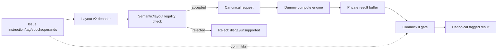

# AutoISA Compute-only CI Harness 工作汇报 / Work Report

> 文档状态 / Document status: 2026-08-07  
> 当前实现 / Current implementation: functional v0 + standalone request queue  
> 目标处理器 / Target processor: CVA6 `cv32a65x`, RV32  
> 验证工具 / Verified with: Vivado/XSim 2025.2

---

# 第一部分：中文工作汇报

## 1. 项目目标

本工作的目标是在 CVA6 外围建立一个 **compute-only Direct-CI Harness**，让一条
32-bit 自定义指令能够描述一个纯计算操作，并通过统一接口完成：

```text
指令识别
  → 操作数/目标寄存器描述
  → 纯计算执行
  → commit/kill 控制
  → tagged result 返回
```

“Compute-only”表示当前 CI 不自行发起 load/store，不修改 CSR，不改变控制流，也不
拥有隐藏的架构状态。计算引擎满足：

```text
results = F(operands, immediate)
```

普通内存访问继续走 CVA6 原有 LSU/MMU/cache。现有 H1 memory experiment 保留为
独立实验，但不进入默认 Harness 数据通路。

## 2. 为什么采用现在的设计

### 2.1 先固定接口，再扩大并发能力

完整 Harness 最终需要 request queue、inflight table、scheduler、result queue、
destination map、operand gather、forwarding 和 writeback。一次性实现这些模块，
很难判断错误来自编码、计算、事务匹配还是 CPU 集成。

因此当前工作按最小闭环推进：

1. 先定义 canonical ABI；
2. 再证明不同 layout 可以正确识别；
3. 用 dummy engine 证明计算语义和多输出；
4. 用单事务 Harness 关闭 commit/kill 竞态；
5. 再独立实现并验证 request queue；
6. 后续逐步替换单事务状态，扩展为多事务 Harness。

这种顺序的好处是每一阶段都有可运行、可验证的交付物。

### 2.2 Encoding 与 semantic engine 解耦

不同 CI 可能需要 2–6 个输入、1–2 个输出或 immediate。如果所有 CI 都固定使用
同一个 RISC-V 字段布局，会过早限制 AutoISA 的 layout/DSE 搜索空间。

因此 decoder 使用每个 layout 独立的 `match/mask`，把不同编码统一转换成
`autoisa_ci_host_desc_t`。后续模块只理解统一 descriptor，不理解指令中每个位的
具体含义。

### 2.3 Host tracking 与 Coprocessor execution 解耦

目标寄存器属于 CPU scoreboard/writeback 问题，不属于纯计算 engine。因此：

- Host descriptor 保存 `src_addr`、`dst_addr` 和 layout；
- Coprocessor request 只携带 operand value、immediate、tag 和 epoch；
- Engine 返回 tagged result，不携带 CPU destination register。

这样未来生成的 CDFG engine 可以复用于不同 transport/backend。

### 2.4 允许投机计算，但禁止投机写回

一条 CI 可能在分支确认前进入执行。如果它位于错误路径，计算可以被丢弃，但不能
污染架构状态。因此 engine completion 与 result visibility 被分开：

```text
engine_done != architectural_writeback
```

结果只有在 matching commit 到达且事务未被 kill 时才会变为可见。kill 在同周期
竞态中优先。

## 3. 当前代码构成

```text
cva6-autoisa/
├─ core/autoisa/
│  ├─ autoisa_ci_types_pkg.sv
│  ├─ autoisa_ci_layout_decoder_v2.sv
│  ├─ autoisa_ci_dummy_engine.sv
│  ├─ autoisa_ci_harness_v0.sv
│  ├─ autoisa_ci_request_queue.sv
│  └─ tb/
│     ├─ tb_autoisa_ci_harness_v0.sv
│     ├─ tb_autoisa_ci_request_queue.sv
│     ├─ autoisa_ci_harness_v0.f
│     └─ autoisa_ci_request_queue.f
├─ docs/
│  ├─ autoisa_ci_harness_v0_plan.md
│  └─ autoisa_ci_harness_work_report_bilingual.md
└─ Bender.yml
```

### 3.1 `autoisa_ci_types_pkg.sv`

该 package 是当前实现的 ABI 源头，定义：

- `XLEN = 32`；
- `MAX_SRC = 6`；
- `MAX_DST = 2`；
- 4-bit tag；
- 2-bit epoch；
- 8-bit CI ID；
- 4-bit layout ID；
- status 和 backend 枚举；
- Host descriptor、canonical request 和 canonical response。

三种主要数据结构为：

```text
autoisa_ci_host_desc_t
  = tag/epoch + ci_id/layout_id
  + source/destination register description
  + immediate + backend

autoisa_ci_req_t
  = tag/epoch + ci_id
  + operand values + immediate

autoisa_ci_rsp_t
  = tag/epoch
  + one/two result values + status
```

Destination register 不进入 `ci_req_t`，这是 Host 与 engine 的明确边界。

### 3.2 `autoisa_ci_layout_decoder_v2.sv`

Decoder 对每个 layout 使用独立的 32-bit `match/mask`。当前提供八种代表性布局：

| Layout | 能力 | 初始语义 | Backend |
|---|---|---|---|
| L0 | 2R1W GPR32 | D0_ADD2 | CVXIF_NATIVE |
| L1 | 3R1W GPR32 | D1_MAC3 | CVXIF_NATIVE |
| L2 | 4R1W GPR8 | D2_MIX4 | DIRECT_CI_EXTENDED |
| L3 | 2R2W derived pair | D3_SUMDIFF | DIRECT_CI_EXTENDED |
| L4 | 4R2W GPR8 | D4_BFLY4X2 | DIRECT_CI_EXTENDED |
| L5 | 6R1W GPR8 | D5_REDUCE6 | DIRECT_CI_EXTENDED |
| L6 | 6R2W GPR8 | D6_DUAL6 | DIRECT_CI_EXTENDED |
| L7 | 2R1W + scattered signed imm10 | D7_IMM_MIX | CVXIF_NATIVE |

GPR8 编码通过 `rvc8()` 映射到 x8–x15。Decoder 还检查：

- destination 不能是 x0；
- derived pair 的 rd0 必须为非零偶数；
- pair 不能从 x31 开始；
- 未命中的指令不被识别。

已用独立检查确认 8 个 match/mask 两两不重叠，代表指令只命中预期 layout。

### 3.3 `autoisa_ci_dummy_engine.sv`

Dummy engine 用于验证接口能力，而不是宣称应用收益。当前实现 D0–D7：

| ID | 计算 | 模拟 latency |
|---|---|---:|
| D0 | `a + b` | 1 |
| D1 | `a*b + c` | 2 |
| D2 | `((a*b)+c) ^ d` | 3 |
| D3 | `a+b`, `a-b` | 2 |
| D4 | complex butterfly two-result form | 4 |
| D5 | six-input reduction sum | 3 |
| D6 | two six-input multiply-accumulate forms | 5 |
| D7 | `(a << shamt) ^ (b + immediate)` | 1 |

Engine 一次接受一个 request。结果在请求接受时按 32-bit bit-vector 语义计算并保存，
`cycles_left_q` 用于模拟 latency。若 response 下游 backpressure，结果保持稳定。

### 3.4 `autoisa_ci_harness_v0.sv`

这是当前功能闭环顶层：



当前顶层只允许一个 live transaction：

```text
issue_ready = no_live_transaction && engine_ready
```

合法请求被转换为 `ci_req_t`。如果 source register 是 x0，对应 operand 被强制置零。
Engine response 先进入 private `result_q`，不会立即对 Host 可见。

结果可见条件为：

```text
result_valid
  = live
  & engine_done
  & commit_seen
  & !killed
  & !matching_kill_this_cycle
```

Commit 和 kill 都按 `tag + epoch` 匹配。支持 result-before-commit 和
commit-before-result 两种顺序。kill 优先于 commit、completion 和 writeback；
已经在运行的 killed request 会等待 engine response 后 drain/drop。

### 3.5 `autoisa_ci_request_queue.sv`

这是并发阶段的第一个独立模块，尚未接入 `harness_v0`。它保存完整
`autoisa_ci_req_t`，支持：

- depth 1/2/4/8；
- ready/valid；
- FIFO 顺序；
- 空队列 fall-through bypass；
- 同周期 enqueue/dequeue；
- 满队列同周期 pop/push replacement；
- full/empty/wrap-around；
- flush；
- occupancy 和 high-watermark；
- enqueue/dequeue/full-stall 累计计数器。

Flush 清空读写指针、occupancy 和 high-watermark，并屏蔽该周期握手；累计流量计数器
保留，便于一次运行结束后统计。

## 4. 当前数据通路和控制通路

### 4.1 数据通路

```text
32-bit instruction
  → per-layout mask/match
  → host descriptor
  → operand normalization
  → canonical request
  → D0-D7 compute
  → canonical response buffer
  → Host-facing result channel
```

### 4.2 控制通路

```text
issue valid/ready
  → transaction becomes live
  → engine request handshake
  → engine completion captured privately
  → matching commit enables visibility
  → matching kill suppresses visibility and releases transaction after drain
```

### 4.3 Tag 与 epoch 的作用

- `tag` 标识 transaction；
- `epoch` 区分 flush 前后可能重复使用的 tag；
- commit、kill 和 result 都必须匹配同一 `tag + epoch`；
- 这为后续多 inflight 和 stale-result rejection 保留了接口基础。

## 5. 仿真与工具验证

### 5.1 Vivado 兼容性修复

本机已定位并使用 Vivado 2025.2：

```text
D:/apps/HLS/2025.2/Vivado
```

真实编译过程中修复了：

1. `matches` 可能与 SystemVerilog 关键字冲突，改为 `match_mask_hit`；
2. `return expression` 改为传统函数名赋值；
3. 在 ``default_nettype none`` 下，把输入端口显式写为 `input wire`；
4. package 增加统一的 ``timescale 1ns/1ps``。

### 5.2 已通过的验证

生产 RTL 和两个 testbench 均通过 Vivado `xvlog` 与 `xelab`。

| Testbench | 结果 | 仿真结束时间 |
|---|---|---:|
| `tb_autoisa_ci_harness_v0` | PASS | 525 ns |
| `tb_autoisa_ci_request_queue` | PASS | 270 ns |

Harness testbench 覆盖：

- L0–L7；
- D0–D7 bit-exact result；
- 1W/2W；
- result-before-commit；
- illegal pair；
- unsupported semantic；
- result backpressure；
- kill suppresses result。

Request queue testbench 覆盖：

- depth 1/2/4/8 elaboration；
- fill/full/stall；
- simultaneous pop/push；
- FIFO order 和 wrap；
- empty bypass；
- flush；
- occupancy/high-watermark/counters。

### 5.3 尚未完成的综合验证

Vivado batch synthesis 当前被本机 Tcl Store 安装问题拦截：

```text
can't find package ::tclapp::support::appinit 1.2
```

该错误发生于 Vivado Tcl app 初始化阶段，不是 RTL parser/elaboration 错误。当前不能据此
声明 synthesis、area 或 timing 已通过。

## 6. 已完成、部分完成和未完成

### 已完成并经 XSim 验证

- canonical types/ABI；
- eight-layout v2-style decoder；
- D0–D7 dummy compute；
- single-live transaction control；
- commit-gated result visibility；
- kill priority/drain；
- result backpressure stability；
- standalone parameterized request queue；
- Vivado compilation/elaboration and unit simulation。

### 已实现但尚未系统集成

- Request queue 尚未接到 Harness/engine；
- 新 v2 Harness 尚未实例化到 CVA6 主流水线；
- Bender 已加入 source，但这只保证 source 可被构建系统发现。

### 尚未实现

- multi-entry inflight table；
- result queue；
- oldest-ready scheduler 和 per-engine skid；
- result credit manager；
- D8–D11 protocol dummy；
- 2-port multi-beat operand gather；
- tagged destination map；
- CI↔CI、CI↔standard RAW/WAW；
- forwarding 和 architectural writeback；
- CVA6 mixed ELF 和 stock regression；
- schema-driven decoder/encoder generation；
- benefit A/B 和 PPA。

## 7. 当前限制与风险

1. `harness_v0` 仍是 single-inflight，不能证明并发收益；
2. operand 由 testbench 直接提供，尚未证明 CVA6 两读口 gather；
3. destination 只存在于 descriptor，尚未真正 reserve/writeback；
4. layout 表当前手写，未来必须由 schema/generator 成为唯一来源；
5. request queue 与 v0 顶层尚未连接；
6. 尚无完整综合、timing 或 area 结果；
7. 当前新增文件仍处于未提交工作区状态。

## 8. 建议下一步

下一步应实现 **inflight table**，而不是直接修改 CVA6：

```text
request queue
  → allocate inflight(tag, epoch, ci_id, state)
  → dispatch dummy engine
  → capture completion
  → commit/kill resolution
  → release entry
```

建议验收点：

- 至少 4 个 outstanding；
- duplicate tag+epoch 被拒绝；
- queued/running/completed 三阶段 kill；
- 每个 accepted request 恰好一个 terminal outcome；
- occupancy > 1；
- 无 entry/credit leak；
- XSim self-checking regression。

完成 inflight + result queue 后，再把当前 single-live 顶层替换为 concurrent shell，最后
进入 destination map、operand gather 和 CVA6 writeback 集成。

---

# Part II: English Work Report

## 1. Objective

The objective is to build a **compute-only Direct-CI Harness** around CVA6. A
32-bit custom instruction should identify a pure computation and travel through
a stable transaction path:

```text
instruction recognition
  → operand/destination description
  → pure computation
  → commit/kill control
  → tagged result return
```

Compute-only means that the CI engine does not issue memory requests, modify
CSRs, redirect control flow, or maintain hidden architectural state. Ordinary
memory operations remain on the existing CVA6 LSU/MMU/cache path.

## 2. Design reasoning

### 2.1 Close a minimal functional loop first

The final Harness needs queues, an inflight table, scheduling, result credits,
operand gathering, destination tracking, forwarding, and writeback. Implementing
all of them at once would make failures difficult to localize.

The work therefore proceeded in reviewable increments:

1. define the canonical ABI;
2. prove flexible instruction-layout decoding;
3. prove pure computation and one/two-result behavior;
4. close commit/kill races with a single live transaction;
5. implement and verify the request queue independently;
6. expand the same interfaces into a concurrent shell.

### 2.2 Decouple encoding from semantics

Different CIs need different combinations of 2–6 inputs, 1–2 outputs, and
immediates. A single fixed RISC-V-like format would constrain the AutoISA
layout/DSE search too early. Each layout therefore owns an explicit match/mask,
while the decoder normalizes all formats into one Host descriptor.

### 2.3 Decouple CPU tracking from engine execution

Destination registers belong to Host scoreboard/writeback logic, not to a pure
semantic engine. The Host descriptor retains register identities; the engine
request contains only values, immediate, tag, epoch, and CI ID. This allows a
generated CDFG engine to be reused behind different transports.

### 2.4 Separate completion from architectural visibility

Speculative computation is allowed, but speculative writeback is not. An engine
may finish before CPU commit, so the result is buffered privately. It becomes
visible only after a matching commit and is suppressed if a matching kill wins.

## 3. Implemented modules

### `autoisa_ci_types_pkg.sv`

Defines the canonical widths, status/backend enums, Host descriptor, canonical
request, and canonical response. The default profile is RV32, up to six sources,
two destinations, a 4-bit tag, and a 2-bit epoch.

### `autoisa_ci_layout_decoder_v2.sv`

Implements eight non-overlapping match/mask layouts covering 2R–6R, 1W/2W, a
derived destination pair, compact GPR8 registers, and a signed immediate. It
normalizes the instruction into `autoisa_ci_host_desc_t` and rejects invalid x0
or pair destinations.

### `autoisa_ci_dummy_engine.sv`

Implements D0–D7 pure functions with modeled latencies of one to five cycles.
The engine accepts one request at a time and holds its tagged response stable
under backpressure.

### `autoisa_ci_harness_v0.sv`

Connects decode, legality checking, request normalization, dummy execution,
private result buffering, and commit/kill gating. It currently permits one live
transaction.

The visibility condition is:

```text
result_valid
  = live
  & engine_done
  & commit_seen
  & !killed
  & !matching_kill_this_cycle
```

Both result-before-commit and commit-before-result are supported. Kill wins over
commit, completion, and writeback.

### `autoisa_ci_request_queue.sv`

Implements a standalone canonical request FIFO with depths 1/2/4/8,
fall-through bypass, simultaneous enqueue/dequeue, full replacement,
wrap-around, flush, occupancy, high-watermark, and lifetime traffic/stall
counters. It is not connected to `harness_v0` yet.

## 4. Verification status

Vivado/XSim 2025.2 was used from:

```text
D:/apps/HLS/2025.2/Vivado
```

All production sources and both testbenches pass `xvlog` and `xelab`.

| Testbench | Result | Finish time |
|---|---|---:|
| `tb_autoisa_ci_harness_v0` | PASS | 525 ns |
| `tb_autoisa_ci_request_queue` | PASS | 270 ns |

Vivado-driven compatibility fixes included explicit input net types under
``default_nettype none``, a package timescale, traditional function return
assignments, and avoiding the `matches` identifier.

Batch synthesis is not yet verified because the local Vivado Tcl Store fails to
load `::tclapp::support::appinit 1.2`. This is an installation-side failure, but
it still means that synthesis, area, and timing must not be claimed as complete.

## 5. Completed versus pending

### Completed and XSim-verified

- canonical ABI;
- eight-layout decoder;
- D0–D7 pure-compute engine;
- single-transaction commit/kill control;
- result backpressure behavior;
- standalone parameterized request queue;
- Vivado compilation, elaboration, and unit simulation.

### Implemented but not integrated

- the request queue is not connected to the Harness/engine;
- the new Harness is not instantiated in the CVA6 pipeline;
- Bender source registration does not by itself provide CPU integration.

### Pending

- multi-entry inflight tracking;
- result queue and completion credits;
- oldest-ready scheduling and engine skid buffers;
- D8–D11 protocol dummies;
- two-port multi-beat operand gathering;
- tagged destination reservation and RAW/WAW handling;
- forwarding and architectural writeback;
- CVA6 mixed ELF and stock regression;
- schema-driven generation, benefit evaluation, and PPA.

## 6. Recommended next increment

Implement the inflight table and connect it to the request queue before touching
the main CVA6 pipeline. The next regression should demonstrate at least four
outstanding requests, duplicate-tag detection, kill in queued/running/completed
states, exactly one terminal outcome per accepted request, occupancy above one,
and no entry or credit leak.

Only after the concurrent coprocessor shell is closed should the work proceed to
Host destination tracking, operand gathering, forwarding, writeback, and full
CVA6 architectural tests.
